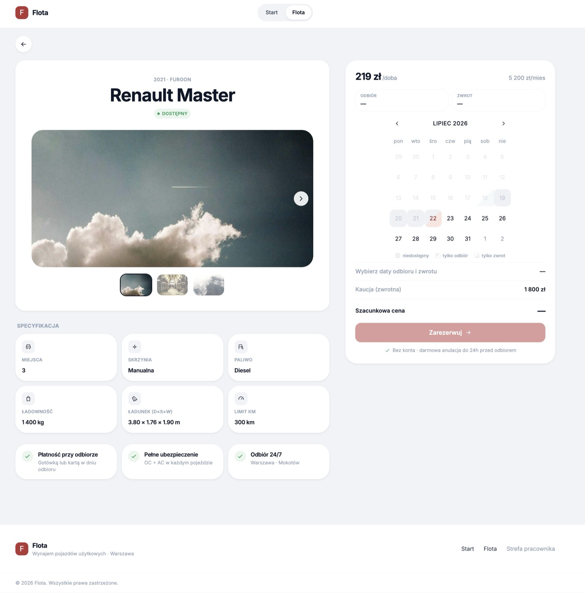
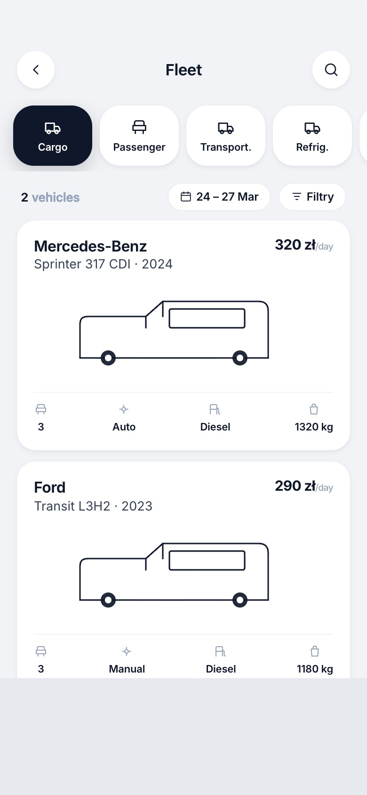
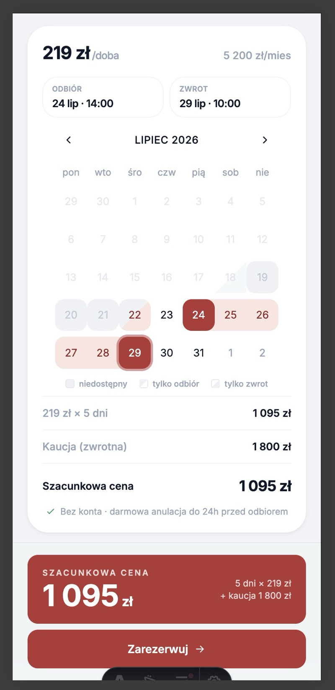
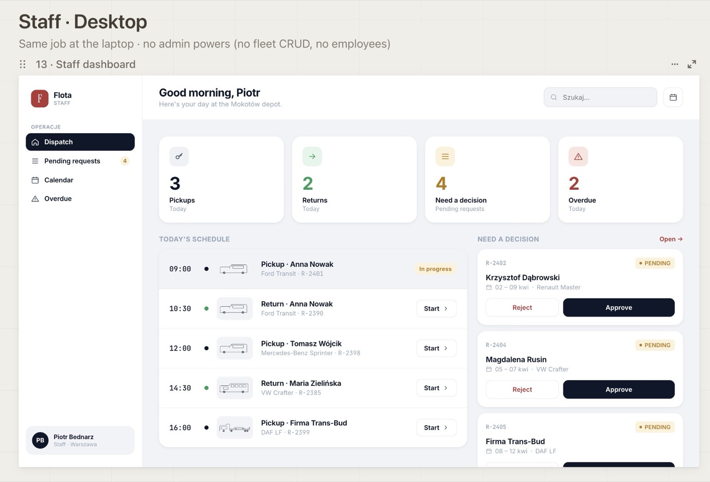
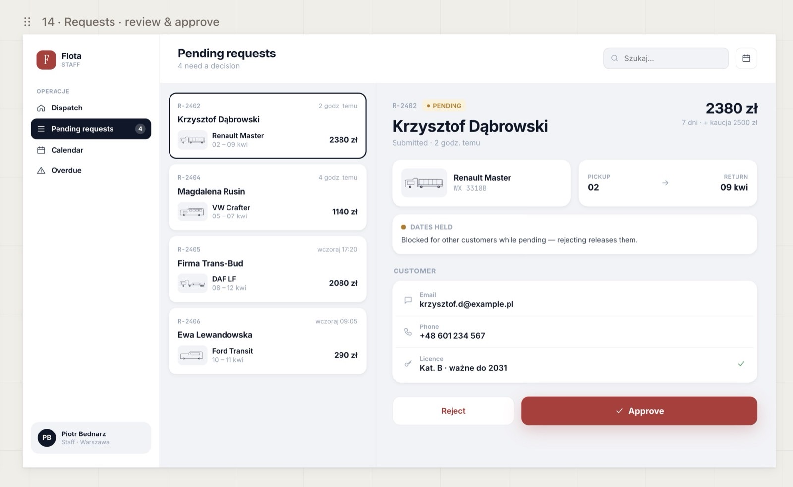
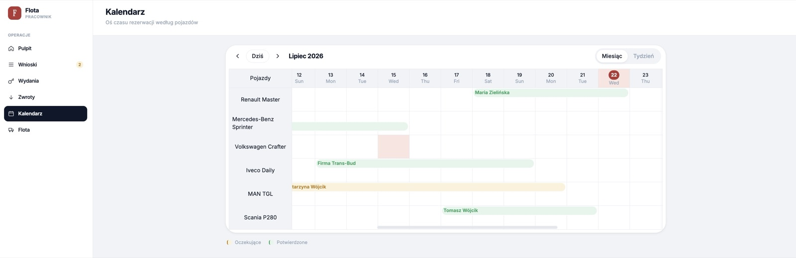
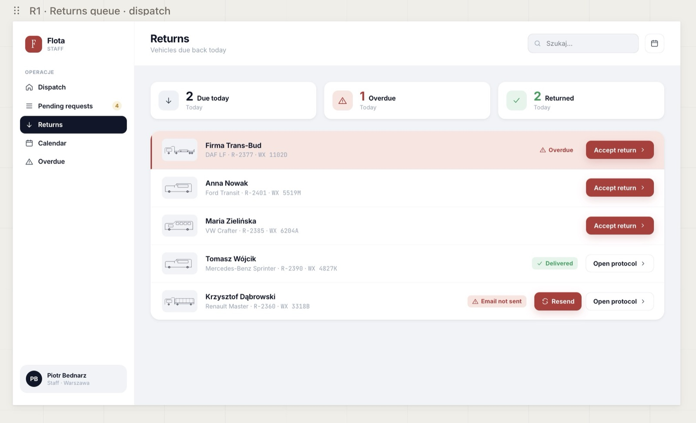
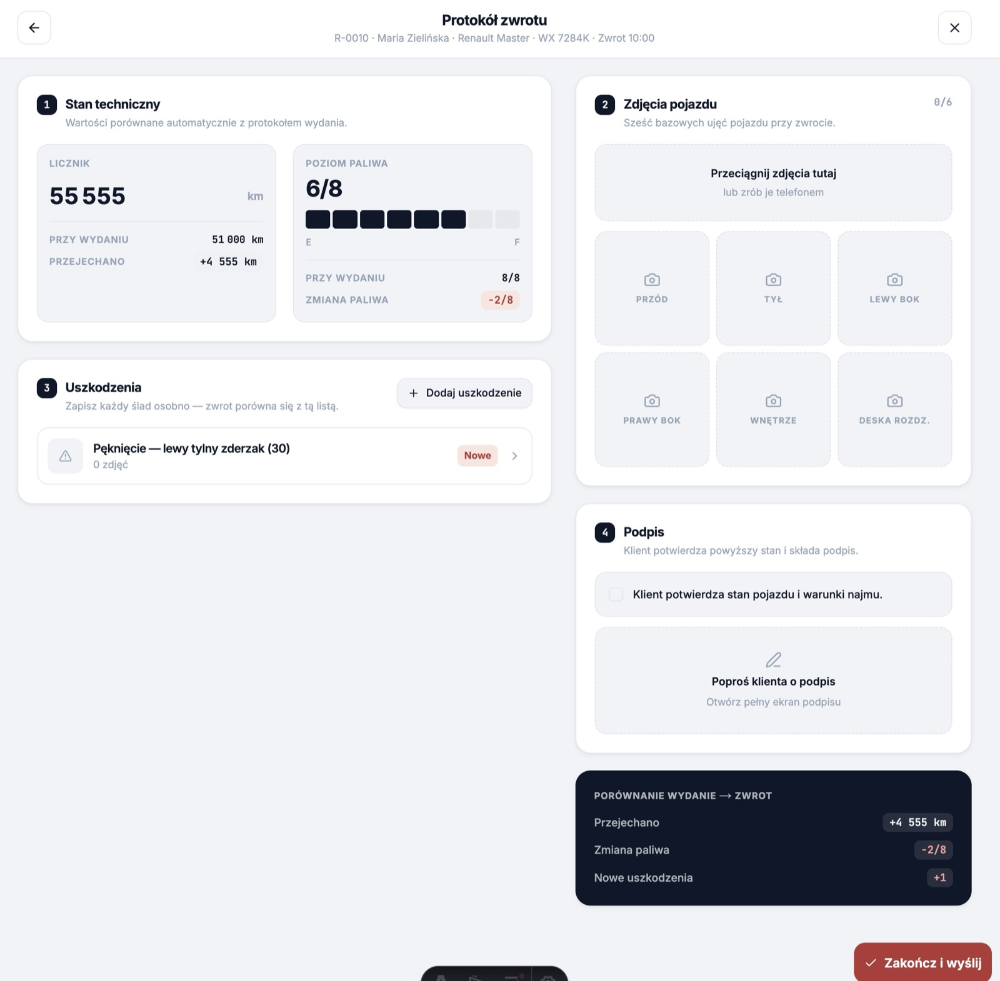
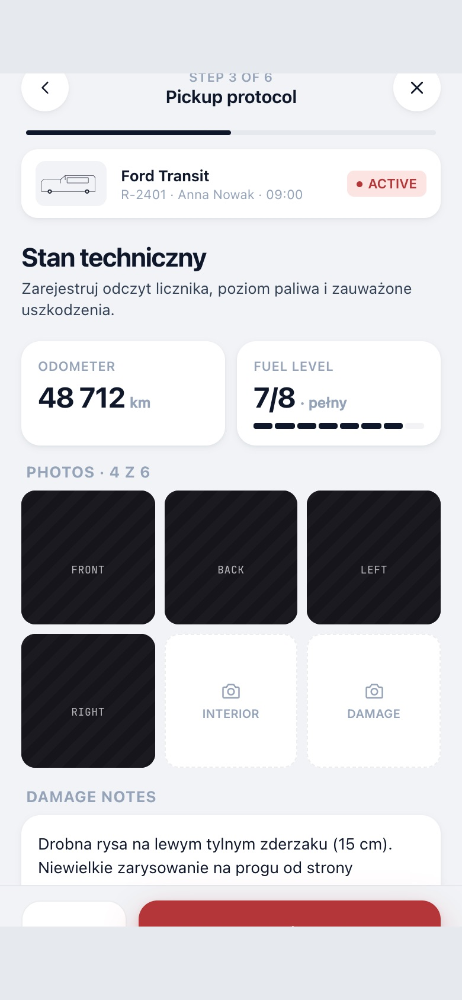

# Flota — Commercial-Vehicle Rental & Fleet Operations

A two-sided rental platform for a Warsaw commercial-vehicle rental company. The public
side is a fast catalog-and-booking front-end where customers browse the fleet — vans,
passenger minibuses, car trailers, refrigerated and curtain-side trucks — and request a
reservation online. The private side is a **staff operations dashboard**: approve or
reject bookings, see the whole fleet on a calendar, and run the physical **handover and
return protocols** — photos, damage records, a generated PDF, and a confirmation email —
end to end.

🔗 **Live:** [fleetrent.marcin-kulbicki.workers.dev](https://fleetrent.marcin-kulbicki.workers.dev)

> _Note: this is a portfolio/case-study README. It documents both the product and the way
> it was built — the spec-driven, AI-assisted build process is itself part of what this
> project demonstrates._

---

## Screens

> _Most screens below are live captures of the running app. A few — the staff dashboard, reservations queue, returns queue, mobile fleet, and handover capture — are still design-reference comps pending a live swap._

### Customer booking

**Book a vehicle** — vehicle detail with a live availability calendar; no account required.



Browse and reserve on mobile:

|                           Fleet                           |                           Reservation                           |
| :-------------------------------------------------------: | :-------------------------------------------------------------: |
|  |  |

### Staff operations

**Dashboard** — the day at a glance: pickups, returns, decisions to make, overdue.



**Reservations queue** — pending requests with approve / reject; a decision fires the customer email.



**Fleet calendar** — every booking across the fleet on one timeline.



**Returns queue** — vehicles due back today, each carrying its email-delivery status.



### Protocols — handover & return

**Return comparison** — the return protocol auto-diffs against the pickup baseline: distance driven, fuel change, and new vs. existing damage, rolled up into a _wydanie → zwrot_ summary.



**Handover capture** happens on mobile, on the lot — odometer, fuel, six photo slots, and damage notes.

<p align="center"></p>

---

## What it is

Two audiences, one app, split across a hard trust boundary:

- **Customers (anonymous).** Browse the catalog, filter by category, check availability
  against real busy-ranges, and submit a reservation request. They never sign in — the
  confirmation email carries a tokenized link to a live status page.
- **Staff (authenticated).** A cookie-authenticated dashboard, gated by role
  (`admin` / `employee`). Staff triage the pending-reservation queue, view the fleet
  calendar, manage vehicles, and run the two physical protocols that bracket every rental:
  **handover** (pickup) and **return**.

The protocols are the heart of the operational side. Each captures per-slot photos (decoded
client-side, HEIC included) and structured damage records, is rendered to a **PDF** on the
server, and is **emailed** to the customer with delivery status tracked. The return protocol
is compared against the pickup baseline, so the record of _new_ damage is unambiguous.

The product is Polish-language (`pl-PL`), with timestamps pinned to `Europe/Warsaw` for
SSR-stable rendering.

## Tech stack

| Layer         | Choice                                                                                        | Why                                                                                |
| ------------- | --------------------------------------------------------------------------------------------- | ---------------------------------------------------------------------------------- |
| Framework     | [Astro 6](https://astro.build/) — SSR (`output: "server"`)                                    | Every page server-rendered at the edge; islands only where interactivity is needed |
| Interactivity | [React 19](https://react.dev/) islands                                                        | Booking flow, calendar, and protocol capture are the client-side surfaces          |
| Language      | [TypeScript 5](https://www.typescriptlang.org/)                                               | DB row types generated from the Supabase schema; typed DTOs in `src/types.ts`      |
| Styling       | [Tailwind CSS 4](https://tailwindcss.com/) + [shadcn/ui](https://ui.shadcn.com/) ("new-york") | Utility-first layout with a handful of accessible primitives                       |
| Backend       | [Supabase](https://supabase.com/) — Postgres + Auth + RLS + Storage                           | Cookie-based SSR auth, row-level security as the access contract, photo storage    |
| Forms         | [React Hook Form](https://react-hook-form.com/) + [Zod](https://zod.dev/)                     | One validation schema shared by the form and the API route                         |
| Documents     | [pdf-lib](https://pdf-lib.js.org/) (+ fontkit)                                                | Server-generated PDF protocols                                                     |
| Email         | [Resend](https://resend.com/)                                                                 | Transactional delivery — confirmations, decisions, protocol PDFs                   |
| Hosting       | [Cloudflare Workers](https://workers.cloudflare.com/)                                         | SSR runtime at the edge (`@astrojs/cloudflare`)                                    |

### Architecture at a glance

- **SSR on the edge.** `output: "server"` via `@astrojs/cloudflare`; there is no static
  prerendering. `Layout.astro` wraps every page and surfaces missing-config banners.
- **Row-level security is the access contract.** The `reservations` table is denied to the
  anonymous role. The public status page resolves through a `SECURITY DEFINER` RPC keyed by
  a bearer token in the URL (`/r/[token]`) — the URL _is_ the credential, and the page is
  `noindex`. Every table carries per-role, per-operation policies.
- **Two trust zones in one deploy.** The public catalog/booking surface (anon) and the
  staff dashboard live in the same app. `src/middleware.ts` resolves the user on every
  request; which paths require which role is a declarative map in `src/lib/access.ts`
  (`ROUTE_ROLES`), evaluated **fail-closed** with `admin ⊇ employee`. Role comes from a
  `profiles.role` lookup, not a JWT claim. Public self-service signup is disabled — every
  account is staff, provisioned deliberately.
- **The protocol pipeline.** Pickup / return capture → photos (client-side HEIC decode) +
  damage records persisted in Supabase → PDF rendered with `pdf-lib` → delivered by Resend →
  outcome recorded in `email_deliveries`. Return protocols diff against the pickup baseline.
- **Single locale, on purpose.** `pl-PL` copy and `Europe/Warsaw` timestamps are pinned so
  SSR output and client hydration agree.

## How it was built

This project was developed **spec-first with an AI coding agent**, using a structured,
markdown-driven workflow (the 10xDevs AI Toolkit). Rather than ad-hoc prompting, every unit
of work flowed through durable artifacts under `context/`:

```
shape an idea  →  PRD  →  tech-stack + infra decisions  →  roadmap
                                                              │
            per change:  identity → plan → plan-review → implement → archive
```

- `context/foundation/` — the durable "what & why": shaping notes, PRD, tech-stack
  rationale, and the roadmap of vertical slices.
- `context/changes/<id>/` — one folder per change, each with a written **implementation
  contract** (plan), research notes, and recorded progress (commit SHAs written back after
  each phase).
- `context/archive/` — completed changes, frozen — including a security pass that found and
  closed an RLS PII-exposure gap on `reservations`.

The result is a codebase where the _reasoning_ behind each decision is checked in alongside
the code, and the implementation was executed one verified slice at a time.

## Getting started

Requires **Node.js v22.14.0** (see `.nvmrc`) and **Docker** (for local Supabase).

```bash
npm install
npx supabase start        # local Postgres + Auth + Storage (prints SUPABASE_URL / SUPABASE_KEY)
npm run dev               # Astro dev server at http://localhost:4321
```

Auth is optional in development — with no Supabase credentials the app still runs and simply
disables the auth-gated features. To exercise the full flow, put the values `supabase start`
prints into `.env` / `.dev.vars`, then `supabase db reset` seeds signable staff accounts
(`admin@fleetrent.test` / `employee@fleetrent.test`, dev-only). Add `RESEND_API_KEY` +
`EMAIL_FROM` to enable email delivery.

Before the first build, run `npx astro sync` to generate the `astro:env/server` virtual
module types.

## Scripts

| Script                      | Does                                                    |
| --------------------------- | ------------------------------------------------------- |
| `npm run dev`               | Start the Astro dev server (Cloudflare workerd runtime) |
| `npm run build`             | Production SSR build                                    |
| `npm run preview`           | Preview the production build locally                    |
| `npm run lint` / `lint:fix` | ESLint with type-checked rules                          |
| `npm run format`            | Prettier (+ Astro + Tailwind class sorting)             |
| `npm test`                  | Unit tests (Vitest, jsdom)                              |
| `npm run test:integration`  | Integration tests (serial, against a local Supabase)    |
| `npm run test:e2e`          | Playwright end-to-end tests                             |
| `npm run test:watch`        | All Vitest projects in watch mode                       |

## Testing

Three layers, each scoped to what it tests best:

- **Unit** (`vitest`, jsdom) — pure functions and components.
- **Integration** (`vitest`, serial) — services and API routes exercised against a **live
  local Supabase**, so RLS policies and RPCs are tested for real, not mocked.
- **E2E** (Playwright) — browser-level flows, following the project's `/10x-e2e` workflow
  (risk → seed → generate → review → verify).

## Project structure

```
src/
├─ pages/
│  ├─ index.astro, fleet/, reserve.astro, r/[token].astro   # public: catalog, booking, tokenized status
│  ├─ dashboard/          # staff: reservations, calendar, pickups, returns, vehicles
│  └─ api/                # vehicles, reservations, protocols, return-protocols, auth (zod-validated)
├─ components/            # React islands (fleet · reservation · protocol · vehicle) + shell + ui (shadcn)
│  └─ hooks/
├─ lib/
│  ├─ services/           # reservations, vehicles, protocols, email-delivery (business logic)
│  ├─ access.ts           # ROUTE_ROLES — the pure, fail-closed role gate
│  └─ supabase.ts · config-status.ts · utils.ts
├─ middleware.ts          # auth + role gate on every request
└─ types.ts               # DB row types + DTOs
supabase/
├─ migrations/            # tables, enums, RLS policies, SECURITY DEFINER RPCs
└─ seed.sql
context/                  # spec-driven build artifacts (PRD, roadmap, change plans, archive)
```

## Deployment

Deployed to **Cloudflare Workers** (SSR) via `wrangler` (worker name `fleetrent`), with
**Supabase** as the managed backend. Set `SUPABASE_URL` / `SUPABASE_KEY` (and `RESEND_API_KEY`
/ `EMAIL_FROM` for email) as Worker secrets. CI (GitHub Actions) runs `astro sync` + lint +
build on every push and PR to `main`.

## Credits

Built by **Marcin Kulbicki**. Scaffolded from the 10x Astro Starter; developed with an
AI-assisted, spec-driven workflow (10xDevs AI Toolkit).
